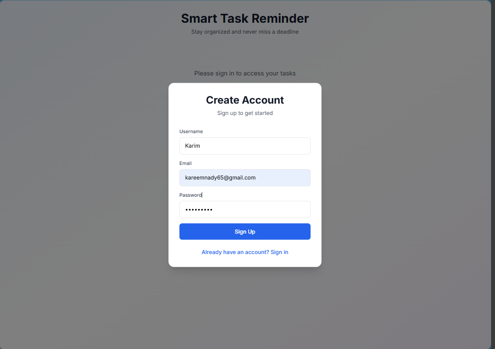
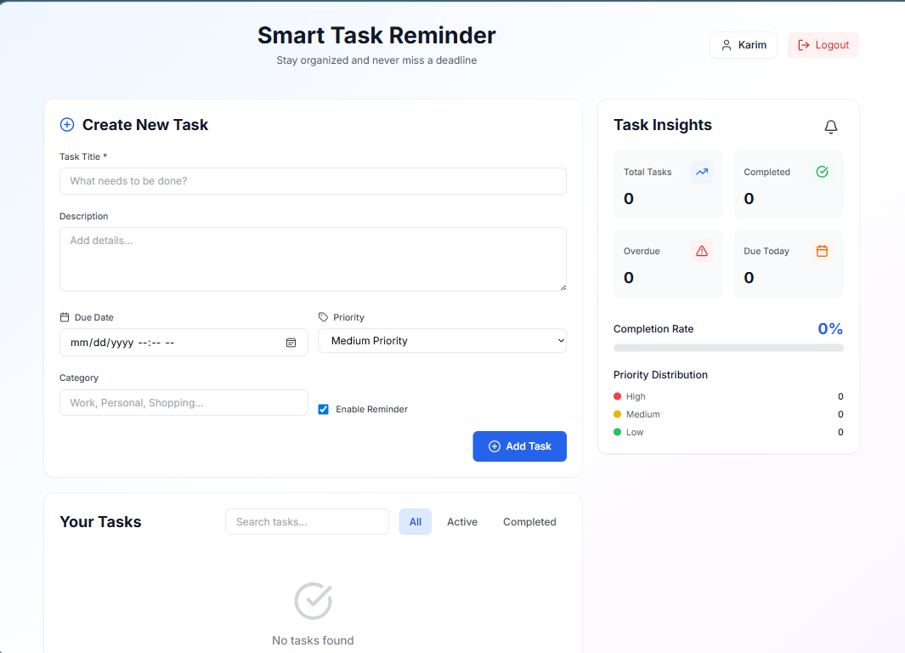
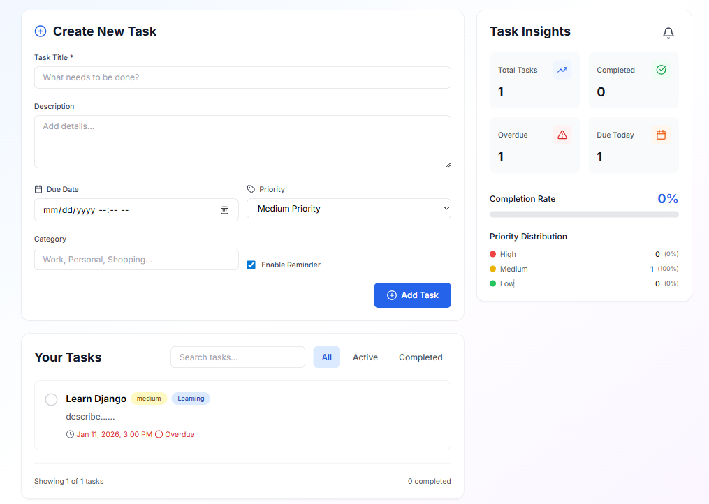
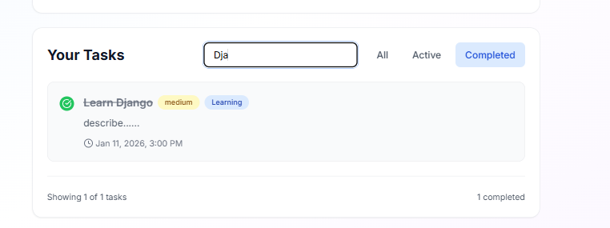

# 📝 Smart Task Reminder

> A modern, full-stack task management application with intelligent reminders, real-time notifications, and a beautiful user interface. Built with FastAPI and React + TypeScript. Never miss a deadline again!

<div align="center">


[Features](#-features) • [Demo](#-demo) • [Tech Stack](#️-tech-stack) • [Installation](#-installation) • [Architecture](#️-architecture) • [API Docs](#-api-documentation)

</div>

---

## ✨ Features

### 🎯 Core Functionality

- **Smart Task Management** – Create, update, organize, and track tasks effortlessly
- **Intelligent Priority System** – Categorize tasks as Low, Medium, or High priority
- **Due Date Tracking** – Set deadlines with automatic reminders 30 minutes before due time
- **Custom Categories** – Organize into Work, Personal, Shopping, and custom categories
- **Real-time Notifications** – Background worker checks every minute for due reminders
- **Advanced Search & Filtering** – Find tasks instantly with search and status filters

### 🔐 Authentication & Security

- **JWT-based Authentication** – Secure token-based login system
- **Password Hashing** – PBKDF2-SHA256 encryption (no 72-byte limit like bcrypt)
- **Protected Routes** – User-specific task isolation with middleware
- **Auto-logout on Token Expiry** – Axios interceptors handle 401 responses
- **Persistent Sessions** – Token stored in localStorage for seamless experience

### 📊 Analytics & Insights

- **Completion Rate Tracking** – Visual progress bar showing productivity
- **Task Statistics Dashboard** – Total, completed, overdue, and today's tasks
- **Priority Distribution** – Pie chart breakdown of task priorities
- **Overdue Alert System** – Never lose sight of pending deadlines
- **Real-time Updates** – Stats update automatically as you complete tasks

### 🎨 User Experience

- **Beautiful Modern UI** – Gradient backgrounds, smooth animations, glass-morphism
- **Fully Responsive Design** – Seamless experience on desktop, tablet, and mobile
- **Toast Notifications** – Instant visual feedback for all actions
- **Modal Authentication** – Non-intrusive login/register popup
- **Loading States** – Skeleton screens and spinners for better UX
- **Keyboard Shortcuts** – Quick actions for power users

### ⚡ Performance & Architecture

- **Type-Safe Development** – Full TypeScript coverage prevents runtime errors
- **Centralized State Management** – React Context API with useReducer
- **Axios Interceptors** – Automatic token injection and error handling
- **Background Job Processing** – APScheduler for scheduled reminders
- **Optimized Database Queries** – SQLAlchemy ORM with eager loading
- **UTC Timezone Consistency** – No timezone drift across deployments

---

## 🎬 Demo

### Screenshots

<div align="center">

#### Login & Authentication



#### Task Dashboard


_Clean, modern interface with task insights_

#### Task Creation


_Intuitive form with all task properties_

#### Notification System


_Real-time reminders in dropdown_

</div>

### Authentication Flow

```
1. User opens app → Auth modal appears
2. Register/Login → JWT token generated
3. Token stored → Auto-attached to all requests
4. Browse tasks → Fully authenticated experience
```

### Task Creation Flow

```
1. Click "Add Task" → Form appears
2. Fill details → Set priority, due date, category
3. Submit → Task created via API
4. Success toast → Task appears in list instantly
```

### Reminder System Flow

```
1. Task created with due date → Notification scheduled
2. 30 minutes before due → Background worker triggers
3. Notification stored → Appears in bell dropdown
4. User clicks → Mark as read
```

---

## 🏗️ Tech Stack

### 🎨 Frontend

| Technology       | Purpose          | Why?                                           |
| ---------------- | ---------------- | ---------------------------------------------- |
| **React 18**     | UI Library       | Modern hooks, concurrent features              |
| **TypeScript**   | Type Safety      | Catch errors at compile-time, better DX        |
| **Axios**        | HTTP Client      | Interceptors, auto JSON, better error handling |
| **Tailwind CSS** | Styling          | Utility-first, rapid development               |
| **Lucide React** | Icons            | Beautiful, lightweight, tree-shakeable         |
| **Context API**  | State Management | Built-in, perfect for small-medium apps        |
| **Vite**         | Build Tool       | Lightning-fast HMR, optimized builds           |

### ⚙️ Backend

| Technology            | Purpose          | Why?                                      |
| --------------------- | ---------------- | ----------------------------------------- |
| **FastAPI**           | Web Framework    | Fast, automatic docs, async support       |
| **SQLAlchemy**        | ORM              | Powerful, flexible, database-agnostic     |
| **SQLite**            | Database         | Simple for dev, easy PostgreSQL migration |
| **Pydantic**          | Validation       | Automatic request/response validation     |
| **JWT (python-jose)** | Authentication   | Stateless, scalable auth tokens           |
| **APScheduler**       | Background Jobs  | In-process scheduler for reminders        |
| **Uvicorn**           | ASGI Server      | High-performance async server             |
| **Passlib**           | Password Hashing | Secure PBKDF2-SHA256 hashing              |

---

## 📁 Project Structure

```
smart-task-reminder/
│
├── 📱 frontend/
│   ├── src/
│   │   ├── types/
│   │   │   └── index.ts                 # TypeScript interfaces & types
│   │   │
│   │   ├── services/
│   │   │   └── api.ts                   # Axios instance + interceptors
│   │   │
│   │   ├── contexts/
│   │   │   ├── AuthContext.tsx          # Auth state (login, logout, token)
│   │   │   └── TaskContext.tsx          # Task state (CRUD operations)
│   │   │
│   │   ├── components/
│   │   │   ├── AuthModal.tsx            # Login/Register modal
│   │   │   ├── AppHeader.tsx            # Header with user info & logout
│   │   │   ├── TaskManager.tsx          # Create task form
│   │   │   ├── TaskList.tsx             # Task display with actions
│   │   │   ├── TaskInsights.tsx         # Statistics sidebar
│   │   │   ├── NotificationDropdown.tsx # Notification bell icon
│   │   │   └── Toast.tsx                # Toast notification component
│   │   │
│   │   ├── App.tsx                      # Root component
│   │   └── main.tsx                     # Entry point
│   │
│   ├── package.json
│   ├── tsconfig.json
│   ├── tailwind.config.js
│   └── vite.config.ts
│
└── 🔧 backend/
    ├── routes/
    │   ├── auth.py                      # POST /auth/register, /login
    │   ├── tasks.py                     # CRUD /tasks endpoints
    │   └── notifications.py             # GET /notifications/*
    │
    ├── operations/
    │   ├── crud.py                      # Database CRUD operations
    │   ├── userAuth.py                  # User authentication logic
    │   └── features.py                  # Business logic (insights, filters)
    │
    ├── workers/
    │   ├── scheduler.py                 # APScheduler configuration
    │   └── reminder_worker.py           # Background reminder processor
    │
    ├── auth/
    │   ├── security.py                  # JWT creation, password hashing
    │   └── dependencies.py              # get_current_user dependency
    │
    ├── models.py                        # SQLAlchemy models (User, Task, Notification)
    ├── schemas.py                       # Pydantic schemas for validation
    ├── database.py                      # Database session & engine
    ├── main.py                          # FastAPI app entry point
    └── requirements.txt                 # Python dependencies
```

---

## 🏛️ Architecture Overview

### Frontend Architecture

#### **State Management Pattern**

```
┌─────────────────────────────────────────┐
│          React Component Tree           │
│                                         │
│  ┌───────────────────────────────────┐ │
│  │        AuthProvider               │ │
│  │  (Global auth state)              │ │
│  │  ├─ token                         │ │
│  │  ├─ user {id, email, username}   │ │
│  │  └─ isAuthenticated              │ │
│  │                                   │ │
│  │    ┌──────────────────────────┐  │ │
│  │    │    TaskProvider          │  │ │
│  │    │  (Global task state)     │  │ │
│  │    │  ├─ tasks[]              │  │ │
│  │    │  ├─ loading              │  │ │
│  │    │  └─ error                │  │ │
│  │    │                          │  │ │
│  │    │  ┌────────────────────┐ │  │ │
│  │    │  │   App Components   │ │  │ │
│  │    │  │  - TaskManager     │ │  │ │
│  │    │  │  - TaskList        │ │  │ │
│  │    │  │  - TaskInsights    │ │  │ │
│  │    │  └────────────────────┘ │  │ │
│  │    └──────────────────────────┘  │ │
│  └───────────────────────────────────┘ │
└─────────────────────────────────────────┘
```

#### **API Layer with Axios Interceptors**

**Request Interceptor Flow:**

```
Component calls taskApi.createTask()
        ↓
  Axios Request Interceptor
        ↓
  Read token from localStorage
        ↓
  Add header: Authorization: Bearer {token}
        ↓
  Send to Backend API
```

**Response Interceptor Flow:**

```
Backend responds (200, 401, 500, etc.)
        ↓
  Axios Response Interceptor
        ↓
  Check status code
        ↓
  ┌─ 200-299: Pass response to component
  ├─ 401: Clear auth, redirect to login
  └─ 500: Log error, show toast
```

**Key Benefits:**

- ✅ **DRY Principle** – Auth logic written once, applied everywhere
- ✅ **Automatic Token Management** – No manual header manipulation
- ✅ **Centralized Error Handling** – Consistent UX across app
- ✅ **Easy Debugging** – Log all requests/responses in one place

---

### Backend Architecture

#### **Request Processing Pipeline**

```
HTTP Request
     ↓
CORS Middleware
     ↓
Route Handler (routes/*.py)
     ↓
Auth Dependency (get_current_user)
     ↓
Pydantic Validation (schemas.py)
     ↓
Business Logic (operations/*.py)
     ↓
Database Layer (SQLAlchemy ORM)
     ↓
Response (JSON)
```

#### **Background Worker System**

```
APScheduler (runs every 1 minute)
     ↓
reminder_worker.py
     ↓
Query notifications WHERE scheduled_for <= NOW() AND sent = False
     ↓
Mark as sent = True
     ↓
(Future: Send email/push notification)
     ↓
Log completion
```

#### **Authentication Flow**

```
POST /auth/login {email, password}
     ↓
Verify password (PBKDF2-SHA256)
     ↓
Generate JWT token (expires in 60 min)
     ↓
Return {access_token, user}
     ↓
Frontend stores in localStorage
     ↓
All future requests include: Authorization: Bearer {token}
     ↓
get_current_user dependency validates token
     ↓
Extract user_id from token payload
     ↓
Fetch user from database
     ↓
Pass user to route handler
```

---

## 🚀 Installation

### Prerequisites

- **Python 3.10+** installed ([Download](https://www.python.org/downloads/))
- **Node.js 16+** and npm installed ([Download](https://nodejs.org/))
- **Git** for cloning ([Download](https://git-scm.com/))

### Quick Start

#### 1️⃣ Clone the Repository

```bash
git clone https://github.com/yourusername/smart-task-reminder.git
cd smart-task-reminder
```

---

#### 2️⃣ Backend Setup

```bash
# Navigate to backend
cd backend

# Create virtual environment
python -m venv venv

# Activate virtual environment
# Windows:
venv\Scripts\activate
# macOS/Linux:
source venv/bin/activate

# Install dependencies
pip install -r requirements.txt

# Run the server
uvicorn main:app --reload
```

✅ Backend running at: **http://localhost:8000**  
📚 API Docs: **http://localhost:8000/docs**

---

#### 3️⃣ Frontend Setup

```bash
# Open new terminal
cd frontend

# Install dependencies
npm install

# Start development server
npm run dev
```

✅ Frontend running at: **http://localhost:5173**

---

#### 4️⃣ First Time Usage

1. Open **http://localhost:5173** in your browser
2. **Register** a new account (email, username, password)
3. **Login** with your credentials
4. **Create your first task** with a due date
5. Check **notifications bell** for reminders (30 min before due time)

---

## 🎮 Usage Guide

### Creating Tasks

**Required Fields:**

- ✅ **Title** – What needs to be done

**Optional Fields:**

- 📝 **Description** – Additional details
- 📅 **Due Date** – When it should be completed
- 🎯 **Priority** – Low / Medium / High
- 🏷️ **Category** – Work, Personal, Shopping, etc.
- 🔔 **Reminder** – Enable/disable notifications

---

### Managing Tasks

| Action              | How To                      | Result                                  |
| ------------------- | --------------------------- | --------------------------------------- |
| **Complete**        | Click circle icon           | ✅ Task marked done, strikes through    |
| **Reopen**          | Click completed task circle | Task returns to active state            |
| **Toggle Reminder** | Click bell icon             | 🔔 Enable/disable notifications         |
| **Delete**          | Click trash icon            | 🗑️ Permanently remove task              |
| **Search**          | Type in search bar          | 🔍 Filter by title/description/category |
| **Filter**          | Click All/Active/Completed  | 📂 Show specific task status            |

---

### Notification System

- **Bell Icon** (top-right) – Shows unread notification count
- **Click Bell** – Opens dropdown with all notifications
- **Notification Trigger** – 30 minutes before task due time
- **Auto-Refresh** – Background worker checks every 60 seconds
- **Mark as Read** – Click notification (future feature)

---

## 📡 API Documentation

### Base URL

```
http://localhost:8000
```

### Authentication Endpoints

#### Register User

```http
POST /auth/register
Content-Type: application/json

{
  "username": "johndoe",
  "email": "john@example.com",
  "password": "securepassword123"
}
```

**Response:**

```json
{
  "access_token": "eyJhbGciOiJIUzI1NiIsInR5cCI6IkpXVCJ9...",
  "token_type": "bearer",
  "user": {
    "id": 1,
    "email": "john@example.com",
    "username": "johndoe"
  }
}
```

#### Login

```http
POST /auth/login
Content-Type: application/json

{
  "email": "john@example.com",
  "password": "securepassword123"
}
```

---

### Task Endpoints (All require authentication)

#### Get All Tasks

```http
GET /tasks?limit=100&status=pending&priority=3
Authorization: Bearer {token}
```

**Query Parameters:**

- `limit` (int) – Max tasks to return (default: 100)
- `offset` (int) – Pagination offset (default: 0)
- `status` (string) – Filter by status (pending/done/cancelled)
- `priority` (int) – Filter by priority (1=low, 2=medium, 3=high)
- `sort_by` (string) – Sort field (default: created_at)
- `order` (string) – asc or desc

#### Create Task

```http
POST /tasks
Authorization: Bearer {token}
Content-Type: application/json

{
  "title": "Buy groceries",
  "description": "Milk, eggs, bread",
  "due_date": "2025-01-15T10:00:00",
  "priority": 2,
  "category": "Shopping",
  "reminder_enabled": true
}
```

#### Update Task

```http
PUT /tasks/{task_id}
Authorization: Bearer {token}
Content-Type: application/json

{
  "completed": true,
  "status": "done"
}
```

#### Delete Task

```http
DELETE /tasks/{task_id}
Authorization: Bearer {token}
```

---

### Notification Endpoints

#### Get Notifications

```http
GET /notifications
Authorization: Bearer {token}
```

#### Get Reminders (Due in 24h)

```http
GET /notifications/reminders
Authorization: Bearer {token}
```

#### Get Overdue Tasks

```http
GET /notifications/overdue
Authorization: Bearer {token}
```

#### Get Task Insights

```http
GET /notifications/summary
Authorization: Bearer {token}
```

**Response:**

```json
{
  "total_tasks": 25,
  "completed_tasks": 15,
  "pending_tasks": 10,
  "overdue_tasks": 3,
  "tasks_due_today": 5,
  "completion_rate": 60.0
}
```

---

## 🔐 Security Features

### Backend Security

| Feature                | Implementation                  | Protection Against          |
| ---------------------- | ------------------------------- | --------------------------- |
| **Password Hashing**   | PBKDF2-SHA256 with salt         | Rainbow tables, brute force |
| **JWT Tokens**         | 60-minute expiry                | Token replay attacks        |
| **User Isolation**     | user_id filter on all queries   | Unauthorized data access    |
| **SQL Injection**      | SQLAlchemy ORM parameterization | SQL injection attacks       |
| **CORS Configuration** | Whitelist-based origins         | Cross-origin attacks        |
| **Input Validation**   | Pydantic schemas                | Invalid data, XSS           |

### Frontend Security

| Feature            | Implementation                   | Protection Against        |
| ------------------ | -------------------------------- | ------------------------- |
| **XSS Prevention** | React automatic escaping         | Cross-site scripting      |
| **Token Storage**  | localStorage (cleared on logout) | Session hijacking         |
| **Auto-logout**    | 401 response interceptor         | Expired token usage       |
| **Type Safety**    | TypeScript strict mode           | Runtime errors            |
| **HTTPS Ready**    | Production build optimized       | Man-in-the-middle attacks |

---

## 🤔 Technology Decisions

### Why Axios over Fetch?

**Fetch (Verbose):**

```javascript
const res = await fetch(url, {
  method: "POST",
  headers: {
    "Content-Type": "application/json",
    Authorization: `Bearer ${token}`, // Manual every time!
  },
  body: JSON.stringify(data),
});
if (!res.ok) throw new Error("Request failed");
const json = await res.json();
```

**Axios (Clean):**

```javascript
const { data } = await axios.post(url, data);
// Token auto-added by interceptor!
// JSON auto-parsed!
// Errors auto-handled!
```

**Benefits:**

- ✅ Request/Response interceptors (auth, logging, retry)
- ✅ Automatic JSON transformation
- ✅ Better error handling (rejects on 4xx/5xx)
- ✅ Request cancellation & timeout support
- ✅ 70% less boilerplate code

---

### Why Context API over Redux?

| Aspect               | Context API       | Redux                 |
| -------------------- | ----------------- | --------------------- |
| **Setup Complexity** | 50 lines          | 200+ lines            |
| **Learning Curve**   | Low               | High                  |
| **Boilerplate**      | Minimal           | Significant           |
| **DevTools**         | React DevTools    | Redux DevTools        |
| **Best For**         | Small-medium apps | Large enterprise apps |

**Our Decision:** Context API is perfect for this app's complexity. Redux would be overkill.

---

### Why FastAPI over Flask/Django?

| Feature           | FastAPI      | Flask       | Django      |
| ----------------- | ------------ | ----------- | ----------- |
| **Performance**   | ⚡ Very Fast | 🐢 Slow     | 🐢 Slow     |
| **Async Support** | ✅ Native    | ❌ Limited  | ❌ Limited  |
| **Auto Docs**     | ✅ Built-in  | ❌ Manual   | ❌ Manual   |
| **Type Hints**    | ✅ Required  | ❌ Optional | ❌ Optional |
| **Validation**    | ✅ Pydantic  | ❌ Manual   | ✅ Forms    |

**Our Decision:** FastAPI's speed, automatic docs, and modern Python features make it ideal.

---

### Why TypeScript over JavaScript?

```typescript
// TypeScript catches this at compile-time:
const task: Task = { title: 123 }; // ❌ Error: Type 'number' is not assignable

// JavaScript allows this (runtime error later):
const task = { title: 123 }; // ✅ No error until you try to use it
```

**Benefits:**

- ✅ Catch bugs before runtime
- ✅ Better IDE autocomplete
- ✅ Self-documenting code
- ✅ Easier refactoring
- ✅ Industry standard for React apps

---

## 🐛 Troubleshooting

### Backend Issues

#### Database Migration Error

```bash
# Solution: Delete DB and restart
rm tasks.db
uvicorn main:app --reload
```

#### Port Already in Use

```bash
# Solution: Change port
uvicorn main:app --reload --port 8001
```

#### Import Errors

```bash
# Solution: Ensure virtual environment is active
# Windows:
venv\Scripts\activate
# macOS/Linux:
source venv/bin/activate

# Reinstall dependencies
pip install -r requirements.txt
```

#### Background Worker Not Running

```bash
# Check logs for:
INFO:     Scheduler started
INFO:     Added job "process_due_reminders"

# If missing, check workers/scheduler.py is imported in main.py
```

---

### Frontend Issues

#### Module Not Found

```bash
# Solution: Clean install
rm -rf node_modules package-lock.json
npm install
```

#### API Connection Failed

```bash
# Check backend is running:
curl http://localhost:8000/

# Check CORS settings in backend main.py:
allow_origins=["http://localhost:5173"]
```

#### 401 Unauthorized After Login

```bash
# Solution 1: Clear storage
localStorage.clear()

# Solution 2: Check token format
localStorage.getItem('token')

# Solution 3: Verify SECRET_KEY matches in:
# - auth/security.py
# - auth/dependencies.py
```

#### TypeScript Errors

```bash
# Solution: Check imports
import { Task } from '../types';

# Run type check
npm run type-check
```

#### Axios Interceptor Not Working

```bash
# Verify axios instance is imported:
import { taskApi } from '../services/api';

# NOT native fetch:
// fetch('/tasks') ❌
// taskApi.fetchTasks() ✅
```

---

## 📦 Dependencies

### Backend (`requirements.txt`)

See included `requirements.txt` file for complete list.

**Core Dependencies:**

- `fastapi==0.104.1` – Web framework
- `uvicorn[standard]==0.24.0` – ASGI server
- `sqlalchemy==2.0.23` – ORM
- `pydantic==2.5.0` – Data validation
- `python-jose[cryptography]==3.3.0` – JWT
- `passlib[bcrypt]==1.7.4` – Password hashing
- `apscheduler==3.10.4` – Background jobs
- `python-multipart==0.0.6` – Form data

### Frontend (`package.json`)

```json
{
  "dependencies": {
    "react": "^18.2.0",
    "react-dom": "^18.2.0",
    "axios": "^1.6.0",
    "lucide-react": "^0.263.1"
  },
  "devDependencies": {
    "@types/react": "^18.2.0",
    "@types/react-dom": "^18.2.0",
    "@vitejs/plugin-react": "^4.2.0",
    "typescript": "^5.3.0",
    "vite": "^5.0.0",
    "tailwindcss": "^3.3.0",
    "autoprefixer": "^10.4.0",
    "postcss": "^8.4.0"
  }
}
```

---

## 🚀 Deployment

### Backend Deployment (Railway / Render)

```bash
# 1. Create Procfile
web: uvicorn main:app --host 0.0.0.0 --port $PORT

# 2. Set environment variables
DATABASE_URL=postgresql://...
SECRET_KEY=your-secret-key-here

# 3. Update database.py for PostgreSQL
```

### Frontend Deployment (Vercel / Netlify)

```bash
# 1. Update API_BASE_URL in services/api.ts
const API_BASE_URL = process.env.VITE_API_URL || 'http://localhost:8000';

# 2. Create .env.production
VITE_API_URL=https://your-api.railway.app

# 3. Build
npm run build

# 4. Deploy dist/ folder
```

---

## 🎯 Future Enhancements

### Planned Features

- [ ] Email notifications (SendGrid integration)
- [ ] Push notifications (Firebase Cloud Messaging)
- [ ] Task sharing & collaboration
- [ ] Recurring tasks (daily, weekly, monthly)
- [ ] Task attachments (file uploads)
- [ ] Dark mode theme toggle
- [ ] Calendar view (month/week)
- [ ] Task templates
- [ ] Export tasks (CSV, PDF, JSON)
- [ ] Google Calendar integration
- [ ] Drag-and-drop task reordering
- [ ] Task comments & activity log
- [ ] Mobile app (React Native)
- [ ] Webhooks for external integrations

### Infrastructure Improvements

- [ ] PostgreSQL database migration
- [ ] Redis for caching
- [ ] Celery for distributed tasks
- [ ] Docker containerization
- [ ] CI/CD pipeline (GitHub Actions)
- [ ] Prometheus metrics
- [ ] Grafana dashboards
- [ ] Rate limiting
- [ ] API versioning
- [ ] WebSocket for real-time updates

---

## 🤝 Contributing

Contributions are welcome! Please follow these steps:

1. **Fork** the repository
2. **Create** a feature branch (`git checkout -b feature/AmazingFeature`)
3. **Commit** your changes (`git commit -m 'Add some AmazingFeature'`)
4. **Push** to the branch (`git push origin feature/AmazingFeature`)
5. **Open** a Pull Request

### Development Guidelines

- Follow existing code style
- Add tests for new features
- Update documentation
- Ensure all tests pass before submitting

---

## 📄 License

This project is licensed under the **MIT License** - see the [LICENSE](LICENSE) file for details.

---

## 👨‍💻 Author

**Your Name**

- GitHub: [@yourusername](https://github.com/yourusername)
- LinkedIn: [Your Name](https://linkedin.com/in/yourprofile)
- Email: your.email@example.com
- Portfolio: [yourportfolio.com](https://yourportfolio.com)

---

## 🙏 Acknowledgments

- [FastAPI](https://fastapi.tiangolo.com/) – Incredible Python web framework
- [React](https://react.dev/) – The library for web and native user interfaces
- [Tailwind CSS](https://tailwindcss.com/) – Rapidly build modern websites
- [Lucide Icons](https://lucide.dev/) – Beautiful & consistent icon toolkit
- [Axios](https://axios-http.com/) – Promise based HTTP client
- [SQLAlchemy](https://www.sqlalchemy.org/) – The Python SQL toolkit

---

## 📊 Project Stats

- **Lines of Code:** ~5,000+
- **Components:** 10+ React components
- **API Endpoints:** 15+ routes
- **Database Models:** 3 (User, Task, Notification)
- **Test Coverage:** TBD
- **Build Time:** < 30 seconds
- **Bundle Size:** ~200KB (gzipped)

---

<div align="center">

### ⭐ Star this repo if you find it helpful!

**Made with ❤️ and ☕ by passionate developers**

[Report Bug](https://github.com/yourusername/smart-task-reminder/issues) · [Request Feature](https://github.com/yourusername/smart-task-reminder/issues) · [Documentation](https://github.com/yourusername/smart-task-reminder/wiki)

</div>
